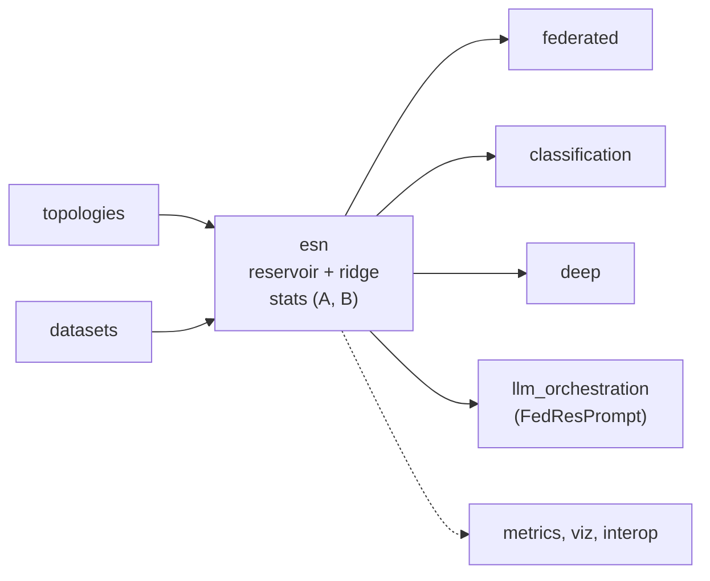

# Concepts

A short, self-contained tour of the ideas behind `esnfed`. For the full
treatment see the [Final Degree Project](https://github.com/daibeal/esnfed) this
library accompanies.

## Reservoir computing in one minute

A recurrent neural network keeps a hidden state that summarises the past. Training
all of its recurrent weights (backpropagation through time) is expensive and
unstable. **Reservoir computing** sidesteps this: the recurrent part — the
*reservoir* — is a large, fixed, randomly connected dynamical system, and only a
**linear readout** is trained.

$$
\mathbf{x}(t) = (1-a)\,\mathbf{x}(t-1) + a\,\tanh\!\big(\mathbf{W}_\text{in}[b;\mathbf{u}(t)] + \mathbf{W}\,\mathbf{x}(t-1)\big),
\qquad
\hat{\mathbf{y}}(t) = \mathbf{W}_\text{out}\,[b;\mathbf{u}(t);\mathbf{x}(t)]
$$

Because $\mathbf{W}$ and $\mathbf{W}_\text{in}$ are frozen, training reduces to a
**ridge regression** for $\mathbf{W}_\text{out}$ — convex, one-shot, fast. This
is what makes Echo State Networks attractive for edge devices, and what makes
them a clean case study for federation.

### The echo state property

For the reservoir to be useful, its state must depend on the input history and
not on its (arbitrary) initial condition. This holds when the **spectral
radius** $\rho(\mathbf{W})$ — the largest absolute eigenvalue — is below~1.
Smaller $\rho$ means faster-fading, shorter memory; closer to~1 means longer
memory at the edge of stability.

## Why federation is easy for ESNs

The readout solves
$\mathbf{W}_\text{out}^\top = (\mathbf{A} + \beta\mathbf{I})^{-1}\mathbf{B}$ with

$$
\mathbf{A} = \mathbf{Z}^\top\mathbf{Z}, \qquad \mathbf{B} = \mathbf{Z}^\top\mathbf{Y},
$$

where $\mathbf{Z}$ stacks the extended states. The key observation: $\mathbf{A}$
and $\mathbf{B}$ are **sums over samples**, so they are *additive across clients*.
Each client computes its own $\mathbf{A}_k, \mathbf{B}_k$ from local data and
sends only those; the server adds them and solves once:

$$
\mathbf{A} = \textstyle\sum_k \mathbf{A}_k, \qquad \mathbf{B} = \sum_k \mathbf{B}_k.
$$

The result is **identical to pooling all the data** — exact, in a single
communication round, with no raw data leaving any client. This is
[`federated_ridge`](guide/federated.md).

!!! note "What 'exact' means precisely"

    Exactness is a statement about a **fixed partition**: given the clients'
    states, $\sum_k \mathbf{A}_k$ equals the Gram matrix of the stacked states to
    machine precision (verified to $10^{-16}$ in `tests/test_invariants.py`).

    Two caveats worth knowing:

    - **Every client harvests from a zero initial state**, so splitting one
      series across *more* clients introduces more transients and does shift the
      aggregate statistics — about 1.5% with no washout, 0.1% with
      `washout=50`. Federating a series into 5 parts is therefore not bit-identical
      to federating it into 2; each is exact with respect to its own partition.
      This is the reason `washout` exists.
    - **The statistics are exact, the readout is conditioning-limited.** The Gram
      matrix of a reservoir is ill-conditioned (around $4\times10^{10}$ at
      $\beta=10^{-6}$), so the solve amplifies floating-point differences:
      $\mathbf{W}_\text{out}$ agrees to ~$10^{-6}$ even when
      $\mathbf{A}$ agrees to ~$10^{-16}$. Predictions — the well-conditioned
      quantity — agree far more closely. Raising $\beta$ tightens both.

## When reservoirs differ

If clients are provisioned independently, their reservoirs differ, and the
readouts live in different spaces — you cannot average parameters. Two answers:

- **Ensemble** — combine *predictions* instead of parameters; robust to any
  structural difference.
- **Structural alignment** — interpolate the reservoirs toward a shared target
  until parameter aggregation becomes valid again.

The empirical finding: the ensemble is the safe default; alignment only pays off
near full homogenisation.

## Library architecture

Topology and dataset generators feed the core `esn` (reservoir + ridge readout);
because its sufficient statistics are additive across clients, federation is a
sum-and-solve. Everything else builds on that core.

## Where it goes next

[FedResPrompt](fedresprompt.md) takes the same efficiency to large language
models: the reservoir becomes an ultra-light *prompt controller* at the edge, and
only a soft-prompt vector (and its gradient) crosses the network.
