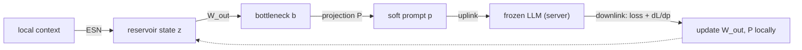

# FedResPrompt

!!! warning "Experimental"
    `esnfed.llm_orchestration` is a research module (`pip install "esnfed[llm]"`).
    The communication/compute advantages below are analytical; the learning has
    been validated as a proof of concept on a real frozen Qwen.

**Federated Reservoir Prompt Orchestration** uses an Echo State Network as an
ultra-lightweight **prompt controller** at the edge. The reservoir turns local
context into a small soft prompt that steers a *frozen* language model on the
server, so only a single prompt vector — and its gradient — ever crosses the
network.



## Split-federated gradient flow

$$
\mathbf{b} = \mathbf{W}_\text{out}\,\mathbf{z}, \qquad \mathbf{p} = \mathbf{P}\,\mathbf{b}
$$

The client sends only $\mathbf{p}$; the server returns the loss and
$\mathbf{g}=\nabla_{\mathbf{p}}L$. The client updates its two small matrices
locally ($\nabla_{\mathbf{P}}L = \mathbf{g}\,\mathbf{b}^\top$,
$\nabla_{\mathbf{W}_\text{out}}L = (\mathbf{P}^\top\mathbf{g})\,\mathbf{z}^\top$),
while the reservoir and the LLM stay frozen.

```python
from esnfed import EchoStateNetwork, topologies
from esnfed.llm_orchestration import EdgeClient, Server, SurrogateLM, split_federated_step

W = topologies.random_reservoir(200, density=0.1, rng=0)
esn = EchoStateNetwork(1, 1, W, spectral_radius=0.9, washout=0)
client = EdgeClient(esn, bottleneck_dim=16, embed_dim=64, n_prompt_tokens=1)
server = Server(SurrogateLM(vocab_size=4, d=64))   # or TransformersLM("Qwen/Qwen2.5-0.5B")

loss = split_federated_step(client, server, context, target)
```

## Why it's cheap

With $m$ soft-prompt tokens and embedding size $d$, FedResPrompt exchanges
$2md$ floats per round, *independent of model depth*; the edge never runs the
LLM. Federated LoRA instead ships adapter weights for every layer and runs the
full forward/backward on the edge.

| Model | FedResPrompt | Federated LoRA | Comm. saving | Edge FLOPs saving |
|-------|-------------:|---------------:|-------------:|------------------:|
| GPT-2 (124M)   | 60 KB  | 2.2 MB  | 38× | 27,106× |
| GPT-2 L (774M) | 100 KB | 11.2 MB | 115× | 225,884× |
| 1.3B           | 160 KB | 12.0 MB | 77× | 385,509× |
| 7B             | 320 KB | 32.0 MB | 102× | 2,056,047× |
| 13B            | 400 KB | 50.0 MB | 128× | 4,015,716× |

*(`experiments/exp7_fedres_prompt.py`; 10 soft-prompt tokens vs. rank-8 LoRA on all layers.)*

<iframe src="../plotly/result_exp7_fedresprompt.html" width="100%" height="440" frameborder="0"></iframe>

## Validated on a real Qwen

With a frozen **Qwen2.5-0.5B** as the server LLM (`TransformersLM`), two
federated clients trained the shared prompt controller to route distinct
contexts to distinct class tokens. Over 15 federated epochs the cross-entropy
fell from **3.3 → 1.6** and held-out accuracy rose from chance (**0.33**) to
**0.67** — confirming the reservoir-generated soft prompt steers a real,
unmodified LLM. (`experiments/exp8_qwen_validation.py`.)

```python
from esnfed.llm_orchestration import TransformersLM
lm = TransformersLM("Qwen/Qwen2.5-0.5B")   # needs torch + transformers
loss, grad = lm.loss_and_grad(prompt, target_token_id)
```

## At scale on a GPU (honest comparison)

On a rented H200, FedResPrompt was run on real frozen LLMs and a real task
(SST-2 sentiment, 4 non-i.i.d. clients). A fixed reservoir + a tiny controller
steer the frozen model to high accuracy across **two families** — Qwen2.5-7B
**0.92**, 14B **0.96**, Mistral-7B **0.95**, 32B **0.83** (peak 0.93), from
zero-shot 0.59–0.82 — transmitting only the controller (**8–25× fewer floats/round**
than Federated LoRA) and **never running the LLM on the client**.

!!! warning "It does not beat a well-tuned LoRA on accuracy"
    In the one fairly-tuned head-to-head (32B), **Federated LoRA is more accurate
    (0.93 vs 0.83)** — but at **25× the communication** and requiring the client
    to run the full LLM. FedResPrompt is a **communication- and edge-efficient
    alternative** (minimal bandwidth, no on-device LLM), not an accuracy-superior
    replacement. It occupies a cheaper corner of the trade-off, it does not
    dominate it.

(Scripts: `experiments/exp12_fedresprompt_gpu.py`, `exp12_sweep.py`,
`exp13_pareto.py`; raw results in `results/gpu/`.)

See the [API reference](api.md#esnfedllm_orchestration).
