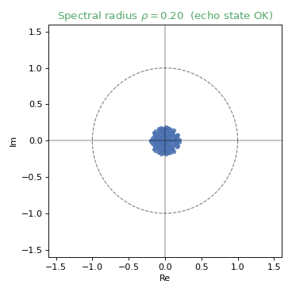
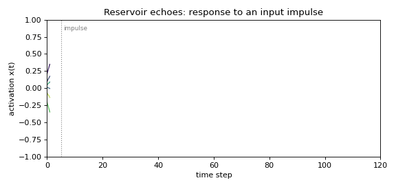

# Gallery

Interactive, data-backed visualisations of the project. Every chart below is a
live Plotly figure (pan, zoom, hover) — the **result charts** are generated
directly from the [results database](results.md) by
[`experiments/build_plotly_gallery.py`](https://github.com/daibeal/esnfed/blob/main/experiments/build_plotly_gallery.py),
and the **reservoir visualisations** by `esnfed.viz`.

!!! tip "Want to drive it yourself?"
    The [playground](playground.html) runs a live Echo State Network you can poke,
    and the [results database](results.md) is queryable in your browser.

## Results from the thesis

### Echo State Network hyper-parameters
Larger reservoirs and a spectral radius near 1 minimise error on NARMA-10.
<iframe src="../plotly/result_exp1_sweep.html" width="100%" height="440" frameborder="0"></iframe>

### Reservoir topology comparison
Topology matters in a task-dependent way (note the log scale).
<iframe src="../plotly/result_exp2_topology.html" width="100%" height="440" frameborder="0"></iframe>

### Federated vs local as the federation grows
Exact federated ridge stays flat; local-only degrades with more, smaller clients.
<iframe src="../plotly/result_exp3_scaling.html" width="100%" height="440" frameborder="0"></iframe>

### FedAvg convergence vs exact ridge
Iterative FedAvg converges slowly toward the one-shot closed-form solution.
<iframe src="../plotly/result_exp3_convergence.html" width="100%" height="440" frameborder="0"></iframe>

### Prediction ensemble (heterogeneous reservoirs)
The ensemble beats local-only and approaches the centralized model.
<iframe src="../plotly/result_exp4_ensemble.html" width="100%" height="440" frameborder="0"></iframe>

### Structural alignment
Parameter aggregation only becomes competitive as reservoirs are homogenised.
<iframe src="../plotly/result_exp5_alignment.html" width="100%" height="440" frameborder="0"></iframe>

### Federated counterparty-risk forecasting
On real, non-stationary financial data local-only training **collapses** (log scale).
<iframe src="../plotly/result_exp6_finance.html" width="100%" height="440" frameborder="0"></iframe>

### FedResPrompt vs federated LoRA
Orders-of-magnitude communication and edge-compute savings across model scales.
<iframe src="../plotly/result_exp7_fedresprompt.html" width="100%" height="440" frameborder="0"></iframe>

### Acceleration backends
Harvest throughput for the optional Numba / float32 / sparse accelerators.
<iframe src="../plotly/result_exp9_performance.html" width="100%" height="440" frameborder="0"></iframe>

### Benchmark classification accuracy
Federated = centralized; ensemble in between; local-only far behind.
<iframe src="../plotly/result_exp10_accuracy.html" width="100%" height="440" frameborder="0"></iframe>

### Reservoir heterogeneity extensions
Depth and heterogeneous leaking rates help long-memory Mackey-Glass; multi-type
nonlinearities help the faster Lorenz task (see [Advanced reservoirs](guide/advanced.md)).
<iframe src="../plotly/result_exp11_heterogeneity.html" width="100%" height="440" frameborder="0"></iframe>

## Reservoir visualisations

=== "Topology"
    <iframe src="../plotly/reservoir.html" width="100%" height="500" frameborder="0"></iframe>
=== "Spectrum"
    <iframe src="../plotly/spectrum.html" width="100%" height="500" frameborder="0"></iframe>
=== "Activations"
    <iframe src="../plotly/states.html" width="100%" height="460" frameborder="0"></iframe>
=== "Forecast"
    <iframe src="../plotly/forecast.html" width="100%" height="420" frameborder="0"></iframe>

## Animations

The spectral radius and the echo state property:

{ width="400" }

A reservoir's fading response to an input impulse:

{ width="600" }
