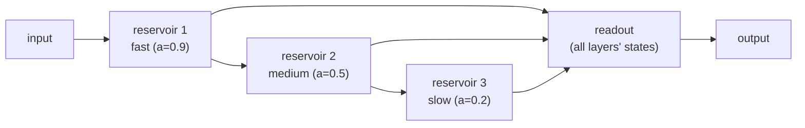

# Advanced reservoirs

Three heterogeneity extensions enrich the reservoir's dynamics. All keep the
readout linear, so they remain **fully compatible with the federated strategies**
— a deep reservoir, in particular, federates *exactly*.

See the measured comparison in the [gallery](../gallery.md) and the
[results database](../results.md) (`exp11_heterogeneity`).

## Heterogeneous leaking rates / time constants

Give each neuron its own leaking rate so different nodes integrate at different
speeds — a single reservoir with multiple time-scales. One of the simplest yet
most effective improvements for multi-scale signals (finance, chaotic systems).

```python
from esnfed import EchoStateNetwork, topologies

a = topologies.leaking_rates(200, kind="layered", low=0.1, high=0.9, n_layers=4, rng=0)
esn = EchoStateNetwork(1, 1, W, spectral_radius=0.95, leaking_rate=a)   # per-node a
```

`kind` can be `"uniform"`, `"log_uniform"`, `"layered"` (decreasing fast→slow
blocks) or `"constant"`. `leaking_rate` accepts a scalar **or** an array of shape
`(n_reservoir,)`.

## Multi-type node nonlinearities

Mix activation functions within one reservoir — `tanh`, `sigmoid`, `relu`, `sin`
(oscillator-like), `identity` — mimicking biological neuronal diversity and
broadening the basis of dynamics.

```python
from esnfed import topologies
from esnfed.esn import ACTIVATIONS         # the available nonlinearities

acts = topologies.mixed_activations(200, types=("tanh", "sigmoid", "sin"), rng=0)
esn = EchoStateNetwork(1, 1, W, spectral_radius=0.9, activation=acts)
# activation also accepts a single name ("sigmoid") or any callable
```

## Hierarchical (deep) reservoirs

Stack reservoir layers — the states of layer $\ell$ feed layer $\ell{+}1$ — each
with its own size, spectral radius and (decreasing) leaking rate. This builds a
hierarchy of progressively slower dynamics and markedly boosts memory and
nonlinearity over a single layer of the same total size.



```python
from esnfed import DeepEchoStateNetwork, topologies

Ws = [topologies.random_reservoir(50, density=0.1, rng=i) for i in range(3)]
deep = DeepEchoStateNetwork(
    1, 1, Ws,
    spectral_radius=0.95,
    leaking_rate=[0.9, 0.5, 0.2],   # per-layer: fast -> slow timescales
    washout=100,
).fit(u_train, y_train)
y = deep.predict(u_test)
```

Per-layer hyper-parameters (`spectral_radius`, `leaking_rate`, `activation`,
`input_scaling`) accept a single value or a list with one entry per layer; the
readout is trained on the concatenation of **all** layers' states.

!!! success "Federates exactly"
    A `DeepEchoStateNetwork` is a drop-in for `EchoStateNetwork` in a federated
    [`Client`](federated.md); its summed sufficient statistics reproduce pooled
    training to machine precision (verified by the test suite).

!!! info "Finding from the research"
    The benefit is **task-dependent**: depth and heterogeneous leaking rates cut
    the long-memory Mackey-Glass error ~4× at a matched size, while multi-type
    nonlinearities help the faster Lorenz task. None is a universal win — match
    the extension to the task's time-scale structure.
