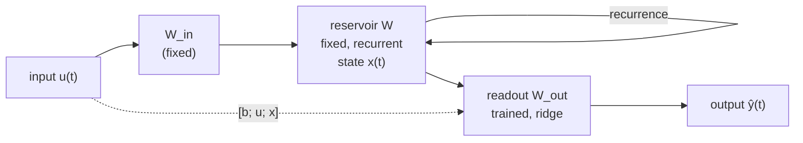

# Echo State Networks

An **Echo State Network** (ESN) is a recurrent network from the *Reservoir
Computing* paradigm. A large, fixed, randomly connected recurrent layer — the
**reservoir** — projects the input into a high-dimensional dynamical feature
space; only a linear **readout** is trained, by ridge regression.



State update (leaky-integrator neurons):

$$
\mathbf{x}(t) = (1-a)\,\mathbf{x}(t-1) + a\,\tanh\!\big(\mathbf{W}_\text{in}[b;\mathbf{u}(t)] + \mathbf{W}\,\mathbf{x}(t-1)\big)
$$

Readout: $\hat{\mathbf{y}}(t) = \mathbf{W}_\text{out}\,[b;\mathbf{u}(t);\mathbf{x}(t)]$.

```python
from esnfed import EchoStateNetwork, topologies

W = topologies.random_reservoir(200, density=0.1, rng=0)
esn = EchoStateNetwork(
    n_inputs=1, n_outputs=1, reservoir=W,
    spectral_radius=0.9,   # largest |eigenvalue| of W after rescaling
    leaking_rate=0.5,      # a in (0, 1]; 1.0 = standard ESN
    input_scaling=1.0,
    ridge=1e-6,            # Tikhonov regularisation of the readout
    washout=100,           # initial transient discarded when harvesting
)
esn.fit(u_train, y_train)
y_hat = esn.predict(u_test)
```

## Acceleration (optional)

Three optional, drop-in accelerators speed up the harvest without changing the
results — see [Performance](../performance.md) for benchmarks and when each helps:

```python
EchoStateNetwork(1, 1, W, sparse=True)        # SciPy CSR reservoir (large N)
EchoStateNetwork(1, 1, W, dtype=np.float32)   # half-precision states (large N)
EchoStateNetwork(1, 1, W, use_numba=True)     # force Numba JIT (small/medium N)
```

With `esnfed[fast]` installed, Numba is enabled automatically for reservoirs up
to `N = 1000`. All three fall back to pure NumPy when their optional dependency
is absent.

## The echo state property

For the reservoir to be useful, its state must depend only on the input history,
not on its initial condition. In practice this is encouraged by keeping the
**spectral radius** below 1. As it grows past 1, the eigenvalues leave the unit
circle and the property is lost:

{ width="380" }

```python
from esnfed import viz
viz.plot_spectrum(esn, backend="matplotlib")  # eigenvalues + unit circle + ρ
```

## Sufficient statistics

Because the readout is a ridge regression, an ESN exposes the two quantities
$\mathbf{A}=\mathbf{Z}^\top\mathbf{Z}$ and $\mathbf{B}=\mathbf{Z}^\top\mathbf{Y}$
(`local_statistics`). These are *additive across clients*, which is exactly what
makes [exact federated training](federated.md) possible.

See the [API reference](../api.md#esnfedesn) for every parameter.
