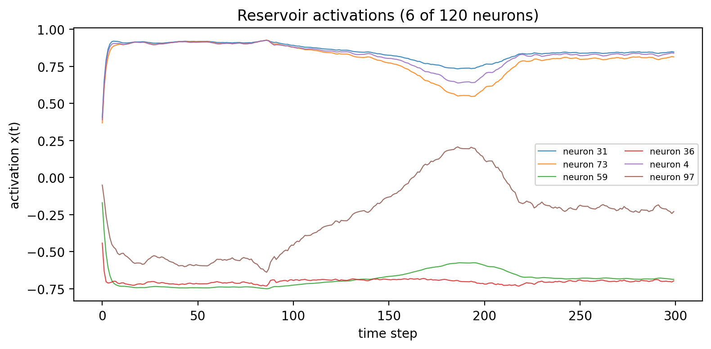
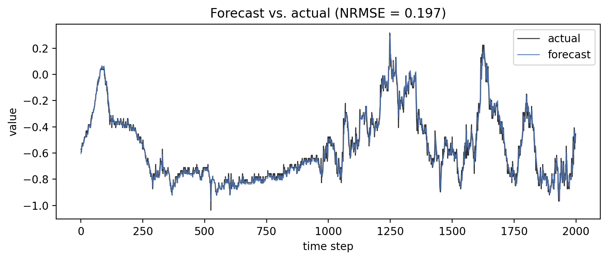

# Visualisation

`esnfed.viz` (optional, `pip install "esnfed[viz]"`) provides four plots, each
available in three backends: **`plotly`** (the default, interactive),
`matplotlib`, and `seaborn`. Every function returns the native figure object.

```python
from esnfed import EchoStateNetwork, topologies, viz

W = topologies.small_world_reservoir(120, k=6, p=0.1, rng=0)
esn = EchoStateNetwork(1, 1, W, spectral_radius=0.9).fit(u_tr, y_tr)

viz.plot_reservoir(esn).show()                  # connectivity graph (degree-coloured)
viz.plot_spectrum(esn).show()                   # eigenvalues + unit circle + ρ
viz.plot_states(esn, u_te).show()               # reservoir activations over time
viz.plot_forecast(y_te, esn.predict(u_te), washout=100).show()

viz.save(viz.plot_spectrum(esn), "spectrum.html")   # or .png (needs kaleido)
```

| Function | Shows |
|----------|-------|
| `plot_reservoir` | reservoir connectivity as a network graph |
| `plot_spectrum` | eigenvalues in the complex plane (echo state property) |
| `plot_states` | a sample of reservoir activations over time |
| `plot_forecast` | predicted vs. actual with NRMSE |

<div class="grid" markdown>




</div>

The default Plotly backend produces fully interactive figures — see them live on
the [Examples](../examples.md) page. See the [API reference](../api.md#esnfedviz).
