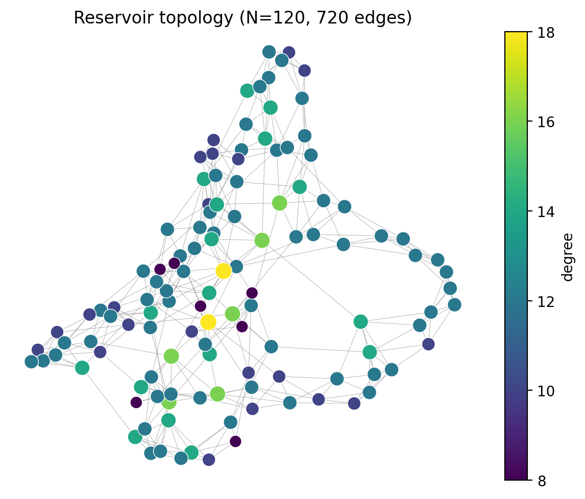
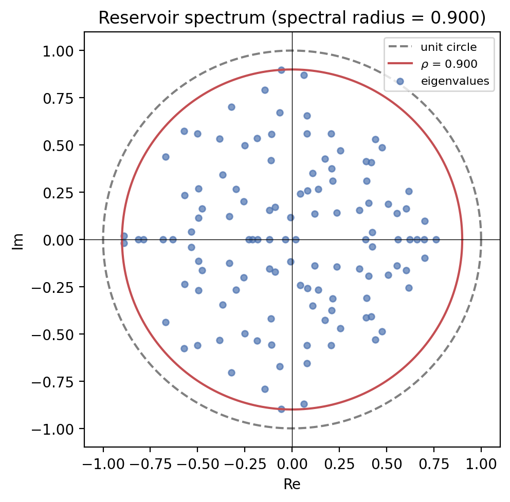

# esnfed

<p align="center">
  <a href="https://pypi.org/project/esnfed/"></a>
  
  
  
</p>

**Echo State Networks for Federated Learning** — a small, dependency-light Python
toolkit for training reservoir-computing models in a **federated** setting, where
several parties jointly train a model without sharing their raw data.

The core depends only on **NumPy** and **NetworkX**.

```bash
pip install esnfed
```

[:material-gamepad-variant: Open the interactive playground](playground.html){ .md-button .md-button--primary target=_blank }
[:material-rocket-launch: Run it live (JupyterLite)](https://daibeal.github.io/esnfed/live/lab/index.html?path=quickstart.ipynb){ .md-button target=_blank }

The **[playground](playground.html)** runs a real Echo State Network in your
browser — drag sliders and watch reservoir activations move, race central vs
federated vs local vs ensemble, and probe the network's memory. No install, no
server.

!!! tip "Why this and not [ReservoirPy](https://reservoirpy.readthedocs.io)?"
    ReservoirPy is the mature library for *building and tuning* reservoir models.
    `esnfed` does **not** replace it — it adds the **federated** layer ReservoirPy
    lacks, and [interoperates](guide/interop.md) with it. Design a reservoir in
    ReservoirPy, federate it here in one line.

## See it

<div class="grid cards" markdown>

-   __Reservoir topology__

    

-   __Echo state property__

    

</div>

The spectral radius controls memory and stability — eigenvalues must stay inside
the unit circle for the *echo state property* to hold:

{ width="380" }

A reservoir's response to an impulse — the fading **echoes** the readout learns
to combine:

{ width="560" }

### Headline result — federation is essential on real data

On the real counterparty-risk series, exact federated ridge stays accurate as the
federation grows while local-only training **collapses** (interactive, log scale):

<iframe src="plotly/result_exp6_finance.html" width="100%" height="430" frameborder="0"></iframe>

See the full [**gallery**](gallery.md) of interactive result charts, the
[playground](playground.html), and the queryable [results database](results.md).

## What's inside

<div class="grid cards" markdown>

-   :material-sine-wave: __Echo State Network__

    Leaky-integrator reservoir + closed-form ridge readout.

-   :material-graph-outline: __Reservoir topologies__

    Erdős–Rényi, small-world, scale-free, ring — and graph descriptors.

-   :material-server-network: __Federated strategies__

    Exact federated ridge, FedAvg, prediction ensemble, structural alignment.

-   :material-chart-line: __Real & synthetic data__

    NARMA-10, Mackey-Glass, Lorenz, and a bundled counterparty-risk series.

-   :material-puzzle: __Interoperability__

    Adapters for ReservoirPy; an example integration with Flower.

-   :material-robot-happy: __FedResPrompt__

    An experimental reservoir prompt-controller for federated LLMs.

</div>

## Next steps

- [Install](install.md) the library (and its optional extras).
- Follow the [Quickstart](quickstart.md).
- Browse the [Examples](examples.md) — interactive Plotly charts and notebooks.
- Read the [API reference](api.md).
